<div align="center">

# ⚡ KEDA Scaling Demo


**Kubernetes Event-Driven Autoscaling** with two independent metric sources —  
AWS AMP (Prometheus) + Dynatrace — plus Cron as a night floor.

</div>

---

## 🏗️ Live Architecture

<div align="center">

</div>

> Dots flowing along each path show live data moving: metrics scraped → KEDA polling → HPA scaling.

---

## 📊 Scaling Phases — Animated

<div align="center">

</div>

---

## 🎯 ScaledObject — Every Field Explained

```yaml
apiVersion: keda.sh/v1alpha1
kind: ScaledObject
metadata:
  name: nginx-keda-sample
  namespace: keda-testing
spec:
  scaleTargetRef:
    name: nginx-keda-sample      # ← must match Deployment name exactly

  minReplicaCount: 1             # ← never scale to zero — avoids cold start
  maxReplicaCount: 10            # ← HPA ceiling

  pollingInterval: 15            # ← KEDA fetches metrics from DT/AMP every 15s
  cooldownPeriod: 60             # ← wait 60s after triggers deactivate before scaling DOWN

  advanced:
    horizontalPodAutoscalerConfig:
      behavior:
        scaleDown:
          stabilizationWindowSeconds: 60
          # ↑ Kubernetes HPA default = 300s (5 min).
          #   Without this, replicas stay elevated for 5 min after load drops.
          #   We align with cooldownPeriod so scale-down happens within ~60s.

  triggers:

    # ── TRIGGER 1: Dynatrace ─────────────────────────────────────────────────
    - type: dynatrace
      authenticationRef:
        name: keda-trigger-auth-dynatrace
        kind: ClusterTriggerAuthentication  # ← cluster-scoped, reusable across namespaces
      metadata:
        metricSelector: >-
          nginx_connections_active
          :filter(and(eq(k8s.namespace.name,keda-testing)))
          :sum
          :fold
        #   :filter → scope to keda-testing namespace only
        #   :sum    → aggregate across all pods in namespace
        #   :fold   → collapse time window into a single average value

        from: "now-2m"
        # ↑ KEDA Dynatrace scaler defaults to from=now-2h if not set.
        #   Problem: :fold over 2h averages 117 min idle + 3 min load → ~5 avg.
        #   Fix: from=now-2m responds to real-time load within one polling cycle.

        threshold: "10"
        # ↑ desiredReplicas = ceil( metricValue / threshold )
        #   metric=100, threshold=10 → ceil(100/10) = 10 replicas

        activationThreshold: "7"
        # ↑ Trigger is INACTIVE unless metric EXCEEDS this value.
        #   Idle nginx_connections_active ≈ 3-6 (keep-alive connections).
        #   Setting >7 prevents false activations from idle noise.

    # ── TRIGGER 2: AMP (Amazon Managed Prometheus) ───────────────────────────
    - type: prometheus
      authenticationRef:
        name: aws-amp
        kind: ClusterTriggerAuthentication
        # ↑ Uses IRSA (pod identity) — zero static credentials
      metadata:
        serverAddress: "${AMP_WORKSPACE_URL}"   # ← injected by Flux postBuild substitution
        metricName: nginx_connections_active
        query: "sum(nginx_connections_active)"
        # ↑ No {namespace="keda-testing"} filter!
        #   Reason: AWS managed scraper (pod_exporter job) does NOT attach
        #   a namespace label to scraped series. Filtered query always returns 0.
        #   All nginx_connections_active series in AMP are from keda-testing only
        #   so unfiltered sum is safe and correct.

        threshold: "20"
        activationThreshold: "10"
        # ↑ AMP scrapes every 60s (point-in-time gauge snapshot).
        #   Load pods hold TCP connections open for 20s each so the 60s
        #   scraper always catches elevated values.
        #   10 pods × ~20 conns/pod = ~200 active connections → well above 20.

        awsRegion: "eu-north-1"

    # ── TRIGGER 3: Cron ──────────────────────────────────────────────────────
    - type: cron
      metadata:
        timezone: "Europe/Stockholm"
        start: "0 18 * * *"      # ← activates at 18:00 Stockholm
        end: "0 6 * * *"         # ← deactivates at 06:00 Stockholm
        desiredReplicas: "1"     # ← holds minimum 1 replica overnight (night floor)
```

---

## 🧮 Key Formulas

### `activationThreshold` vs `threshold`

| Field | When it applies | Formula |
|---|---|---|
| `activationThreshold` | Gate — trigger **inactive** below this | `if metric ≤ activationThreshold → isActive: false, replicas stay at min` |
| `threshold` | Scale target **per replica** when active | `desiredReplicas = ceil( metric / threshold )` |

```
idle:   metric = 5,   activationThreshold = 7   → inactive, replicas = 1
load:   metric = 100, threshold = 10             → ceil(100/10) = 10 replicas
```

### OR Semantics — Multiple Triggers

```
DT  isActive=true  →  ceil(150 / 10) = 15  →  capped at maxReplicaCount = 10
AMP isActive=true  →  ceil(200 / 20) = 10

HPA desiredReplicas = max(DT=10, AMP=10) = 10
```

Both triggers must go **inactive** before cooldown starts.  
Either trigger alone keeps replicas scaled up.

---

## 🔑 Authentication

### Dynatrace — SealedSecret chain

```
ClusterTriggerAuthentication
  └── secretTargetRef
        └── dt-keda-token (Secret, keda namespace)
              ├── token: <DT API token>  ← encrypted with Bitnami SealedSecrets
              └── host:  https://jzw21825.live.dynatrace.com
                         ↑ must be live.dynatrace.com
                           Metrics v2 API NOT available on apps.dynatrace.com
```

### AMP — IRSA (no static credentials)

```
ClusterTriggerAuthentication
  └── podIdentity.provider: aws
        └── KEDA operator ServiceAccount
              └── EKS IRSA → IAM Role
                    └── aps:QueryMetrics on AMP workspace ARN
```

---

## 🎬 Demo Flow

```
┌─────────────────────────────────────────────────────────────────────┐
│ PHASE 0 — Baseline                                                  │
│   nginx_connections_active ≈ 3-6 (idle keep-alive)                 │
│   DT: inactive (≤7)  AMP: inactive (≤10)  replicas: 1              │
└──────────────────────────┬──────────────────────────────────────────┘
                           │ launch 5 load pods
                           │ each: 1 persistent TCP conn/sec, held 20s
                           │ warmup → ~100 active connections
                           ▼
┌─────────────────────────────────────────────────────────────────────┐
│ PHASE 1 — Dynatrace fires                                           │
│   DT 2m fold: ~100  >  activationThreshold=7  ✔                    │
│   desiredReplicas = ceil(100/10) = 10                               │
│   AMP: still inactive (scrape interval 60s, waiting for sample)     │
│   replicas: scale up ↑                                              │
└──────────────────────────┬──────────────────────────────────────────┘
                           │ launch 5 more pods (10 total)
                           │ ~200 active connections
                           │ AMP 60s scraper captures spike
                           ▼
┌─────────────────────────────────────────────────────────────────────┐
│ PHASE 2 — AMP fires                                                 │
│   AMP value: ~200  >  activationThreshold=10  ✔                    │
│   desiredReplicas = ceil(200/20) = 10                               │
│   Both DT + AMP active → HPA = max(10, 10) = 10                    │
└──────────────────────────┬──────────────────────────────────────────┘
                           │ delete all load pods
                           │ nc connections drain in ~20s
                           │ both triggers deactivate
                           ▼
┌─────────────────────────────────────────────────────────────────────┐
│ PHASE 3 — Cooldown                                                  │
│   cooldownPeriod=60s + stabilizationWindowSeconds=60s elapse        │
│   replicas: scale down to 1 ↓                                       │
└─────────────────────────────────────────────────────────────────────┘
```

---

## 🐛 Lessons Learned

| # | Problem | Root Cause | Fix |
|---|---|---|---|
| 1 | DT trigger never fired at `threshold=7` | KEDA defaults `from=now-2h`; `:fold` 2h average barely moves during short load test | Add `from: "now-2m"` explicitly |
| 2 | AMP metric always `0` | `pod_exporter` scraper doesn't attach `namespace` label; `{namespace="keda-testing"}` always returns empty | Remove filter → `sum(nginx_connections_active)` |
| 3 | nginx oscillated between 1 and 2 replicas at idle | `activationThreshold=3` was below idle baseline of 3-6 conns; triggers permanently active | Raise to DT=7, AMP=10 |
| 4 | Replicas took 5 min to scale down after load removed | HPA default `stabilizationWindowSeconds=300` | Set `stabilizationWindowSeconds: 60` in ScaledObject `advanced` |
| 5 | `unsupported protocol scheme ""` on DT | SealedSecret sealed without `https://` prefix | Reseal with full URL |
| 6 | `404` on Dynatrace API call | Used `apps.dynatrace.com` instead of `live.dynatrace.com` | Metrics v2 only on `live.dynatrace.com` |
| 7 | `400 Illegal transform operator :sum` | `.count` metrics don't support `:sum` transform | Remove `:sum` or use different metric |
| 8 | `nginx_connections_active` always `3` in AMP under wget load | wget requests complete in `<1ms`; AMP 60s scraper misses them | Switch to `nc` persistent connections (held open 20s) |

---

## 📁 Repository Layout

```
gitops-helm/
└── dataplatform-devtest-eks/releases/platform-engineering/keda-testing/
    └── scaledobject.yaml

aws-eks-platform/
└── dataplatform-clusters/devtest/releases/keda/
    ├── dt.yaml                   # ClusterTriggerAuthentication
    └── dt-keda-token.yaml        # SealedSecret (encrypted DT token + host)

~/Desktop/keda/
└── demo-scaling.sh               # interactive demo script
```
